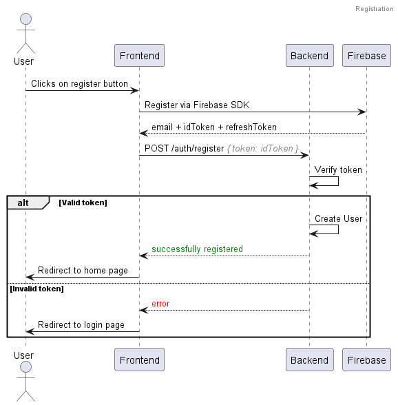
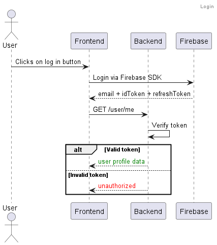

# Swap API Documentation

## Authentication

For authentication, Firebase is used. Frontend will use Firebase SDK to get access tokens and refresh tokens. When user
registers, backend endpoint `/auth/register` must be called with `{ token: string }` payload to create a user profile in
the database.

Then, with each request, frontend has to send the access token in the `Authorization` header as `Bearer
<access_token>`. Backend will verify the token every time and if it's expired, it will return `401 Unauthorized` status.

### Possible Improvements

- Caching is not recommended by Firebase, since validating the token is a heavy operation.
- If there are a lot of users, the profile creation should be handled by `AWS Lambda`.

